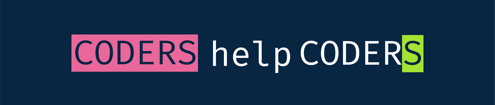

A repository to help young coders get their opportunities 

[List of 2021's events](https://github.com/chrislevn/CodersHelpCoders/tree/main/2021/Events)

[List of 2021's conferences](https://github.com/chrislevn/CodersHelpCoders/tree/main/2021/Conferences)

[List of 2021's job postings](https://github.com/chrislevn/CodersHelpCoders/tree/main/2021/Jobs/Spring%20-%20Internship)

[List of 2021's hackathons/contests](https://github.com/chrislevn/CodersHelpCoders/tree/main/2021/Hackathons)

[List of learning resources](https://github.com/chrislevn/CodersHelpCoders/tree/main/Learning%20Resources)

## Why you should join us: 
### 1. Join a community of like-minded techies: 
https://discord.gg/3FYPBGJy

### 2. Create *a new issue* with your resume to get it reviewed
##### Track your resume's versions overtime by filtering "Author" in the Issue section with your Github username

### 3. Access latest opportunities shared by members all around the world Some of the benefits are: 
- Get latest news
- Find referrals for your company
- Find teammate for your projects/hackathons
- Get helps for your coding problems
...

🤗 **Contributing by submitting a [pull request](https://github.com/susam/gitpr#create-pull-request) or filling in this [form](https://forms.gle/ujkessKAEgd2hUzJ7)** 🤗
#### Use [HackMD.io](https://hackmd.io/) to get familiar with Markdown

If you like this repo, feel free to leave a ⭐. It means alot to us.
